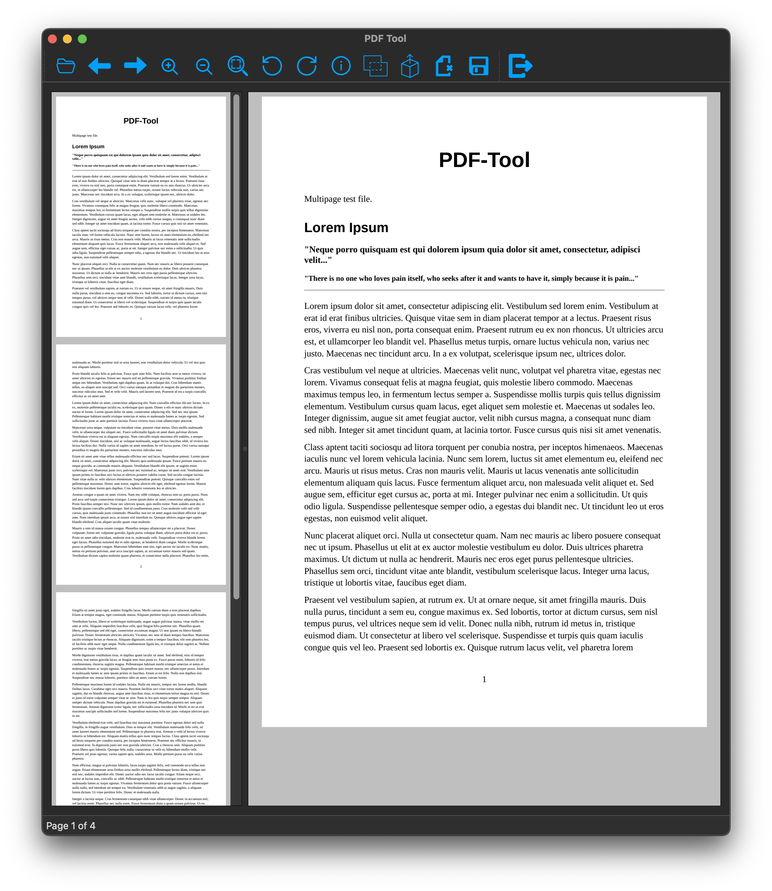

# PDF-Tool

This is a simple PDF reader and tool to manipulate PDF documents.

It relies on pypdf for PDF document manipulation.

### PDF Document Operations

- View and modify PDF document, multi page and single page view available.
- Rotate pages
- Append PDF to existing document
- Extract page
- Split document into single pages
- Remove pages

### Technologies used

- Pyside6
- pypdf

### Building

run pyinstaller main.spec to build app on MacOS
